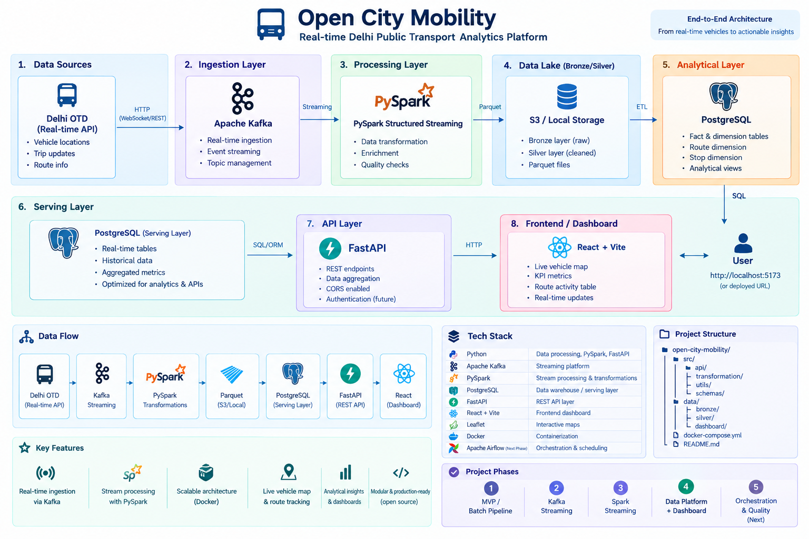

# 🚦 Open City Mobility

> An open-source real-time city mobility and traffic intelligence platform for ingesting, processing, validating, and analyzing live public transportation data.

**Open City Mobility** is a community-driven Data Engineering project that turns real-time urban mobility data into a reusable data platform.

The project currently focuses on **Delhi public transit data** and is designed to eventually support multiple cities, mobility data sources, streaming pipelines, analytics, dashboards, alerts, and machine learning.

---

## 🎯 Project Vision

Cities continuously generate transportation data.

Buses move through different locations, routes become busy, services change, vehicles slow down, and mobility patterns change throughout the day.

The goal of this project is to build an open-source platform that continuously collects this data and transforms it into useful mobility intelligence.

### Architecture



### Long-term vision

```text

            Public Data Sources

                    │

                    ▼

               Ingestion

                    │

                    ▼

              Event Streaming

                    │

                    ▼

                 Bronze

                    │

                    ▼

                 Silver

                    │

                    ▼

                  Gold

                    │

                    ▼

            Serving / API Layer

                    │

                    ▼

            Analytics / Dashboard

                    │

          ┌─────────┴─────────┐

          ▼                   ▼

        Alerts                ML

```

---

# 🚧 Project Status

Current Stage — Analytics + Community Expansion

The project has moved beyond the initial MVP and now contains a working realtime data platform and application layer.

✅ Completed

### Data Ingestion

* Delhi Open Transit Data realtime API integration
* GTFS-Realtime vehicle position ingestion
* Continuous API polling
* Raw realtime feed storage

### Data Processing

* GTFS-Realtime protobuf decoding
* Bronze layer
* Silver layer
* Historical Silver processing
* GPS coordinate validation
* Timestamp validation
* Duplicate handling
* Observation-gap filtering
* Speed anomaly detection

### Mobility Analytics

* Vehicle movement calculation
* Haversine distance calculation
* Speed estimation
* Route performance analysis
* Hourly vehicle activity
* Snapshot-level mobility metrics
* Historical hourly comparisons
* Mobility anomaly detection
* Real-time mobility alerts

### Kafka Streaming

* Apache Kafka 4.0.2 local deployment
* Kafka `vehicle_positions` topic
* 3 Kafka partitions
* Python producer
* Python consumer
* Consumer groups
* Offset tracking
* Consumer lag monitoring
* Kafka → Bronze consumer
* JSON event schema
* Event validation

### PySpark Streaming

* PySpark 4.2.0
* Spark Structured Streaming
* Kafka → PySpark
* Kafka JSON parsing
* Streaming Silver pipeline
* Event-time processing
* Watermarking
* Streaming data-quality validation
* Invalid-event quarantine

### PostgreSQL Data Platform

* PostgreSQL 16 local deployment
* Historical `vehicle_positions`
* `latest_vehicle_positions`
* `routes`
* `stops`
* `route_activity_summary`
* PySpark → PostgreSQL
* Latest vehicle-position upsert
* Automated route-summary refresh

### Serving & Dashboard

* FastAPI serving layer
* Health endpoint
* Live vehicle endpoint
* Metrics endpoint
* Route activity endpoint
* Anomaly endpoint
* Alert endpoint
* React dashboard
* Live vehicle map
* Route activity table
* Live auto-refresh

### Orchestration & Quality

* Airflow 3 local deployment
* Scheduled mobility pipeline
* Reusable data-quality checks
* Automated pipeline monitoring
* Data observability metrics
* Data lineage documentation
* GitHub Actions CI

### Community Expansion

* Multi-city configuration
* UP test-city configuration for Lucknow, Meerut, Noida, and Kanpur
* Common city loader

---

## 🚧 Current Stage

The project has progressed from the Data Platform into the Application / Analytics Layer and is now beginning the Community Expansion and Advanced Platform phases.

Current architecture:

```text
Delhi OTD / City Connectors
↓
Python Ingestion
↓
Apache Kafka
↓
PySpark Structured Streaming
↓
Bronze → Silver → Gold
↓
PostgreSQL Serving Layer
↓
FastAPI
↓
React Dashboard
↓
Live Map + Route Analytics + Anomalies + Alerts
↓
Community / Multi-City Framework
```

The platform currently provides a working Delhi realtime mobility pipeline, Airflow orchestration, automated quality checks, monitoring and observability, historical mobility analytics, a live vehicle map, anomaly detection, alerts, and a dashboard backed by FastAPI.

The next stage focuses on making the platform easier for contributors to extend across cities and data sources, followed by AI-assisted mobility intelligence, prediction, and cloud-native deployment.

---

# 📡 Current Data Sources

Production / Development Source

The primary realtime source is Delhi Open Transit Data (OTD).

Official source:

```text
https://otd.delhi.gov.in/
```

Realtime vehicle events include:

* Vehicle ID
* Route ID
* Trip ID
* Latitude
* Longitude
* Vehicle timestamp
* Vehicle status

Multi-City Testing

The multi-city framework currently includes test configurations for:

```text
Lucknow
Meerut
Noida
Kanpur
```

These UP cities are currently configuration-level test entries and are not represented as live production connectors unless a verified realtime source is available.

---

# 🏗️ Architecture

## Historical Pipeline

```text

Delhi OTD API

  │

  ▼

Python Ingestion

  │

  ▼

🥉 Bronze

  │

  ▼

Decode + Clean

  │

  ▼

🥈 Silver

  │

  ▼

Mobility Analytics

  │

  ▼

🥇 Gold

```

## Realtime Streaming Pipeline

```text

Delhi OTD API

  │

  ▼

Python Producer

  │

  ▼

Schema Validation

  │

  ▼

Apache Kafka

  │

  ▼

vehicle_positions

  │

  ▼

PySpark Structured Streaming

  │

  ▼

Data Quality

  │

  ├──────────────┐

  ▼              ▼

Valid           Invalid

  │              │

  ▼              ▼

Streaming Silver  Quarantine

```

## Serving Pipeline

```text

Streaming Silver

  │

  ▼

PostgreSQL

  │

  ├──────────────────────────┐

  ▼                          ▼

vehicle_positions      latest_vehicle_positions

Historical Events          Current State

  │                          │

  └────────────┬─────────────┘

               ▼

      route\_activity\_summary

               │

               ▼

            FastAPI

               │

               ▼

           Dashboard

```

---

# 📁 Project Structure

```text
open-city-mobility/

│

├── airflow/

│   ├── dags/

│   │   └── mobility_pipeline.py

│   ├── logs/

│   └── plugins/

│

├── config/

│   └── cities.json

│

├── data/

│   ├── bronze/

│   │   └── stream/

│   ├── silver/

│   │   ├── streaming/

│   │   └── stateful_vehicle_positions/

│   ├── gold/

│   ├── ml/

│   ├── quarantine/

│   │   └── vehicle_positions/

│   └── reference/

│

├── schemas/

│   └── vehicle_position.json

│

├── scripts/

│   └── refresh_route_summary.sh

│

├── src/

│   │

│   ├── ai/

│   │   └── __init__.py

│   │
│   ├── api/

│   │   ├── __init__.py

│   │   └── main.py

│   │
│   ├── ingestion/

│   │   └── delhi_transit.py

│   │
│   ├── ml/

│   │   └── create_features.py

│   │
│   ├── quality/

│   │   ├── __init__.py

│   │   ├── checks.py

│   │   └── runner.py

│   │
│   ├── transformation/

│   │   ├── vehicle_positions.py

│   │   ├── build_historical_silver.py

│   │   ├── hourly_vehicle_activity.py

│   │   ├── vehicle_movement.py

│   │   ├── route_performance.py

│   │   ├── snapshot_metrics.py

│   │   ├── load_routes_postgres.py

│   │   └── route_activity_summary.py

│   │
│   └── streaming/

│       ├── vehicle_producer.py

│       ├── vehicle_consumer.py

│       ├── bronze_consumer.py

│       ├── pyspark_kafka.py

│       ├── pyspark_vehicle_parser.py

│       ├── pyspark_vehicle_silver.py

│       ├── pyspark_vehicle_quality.py

│       ├── pyspark_event_time.py

│       ├── stateful_vehicle_tracking.py

│       ├── pyspark_postgres_sink.py

│       └── pyspark_latest_vehicle_sink.py

│

├── tests/

│   └── test_quality.py

│

├── docs/

│   ├── data_lineage.md

│   └── images/

│       └── dashboard.png

│

├── deployment/

│   ├── docker/

│   ├── scripts/

│   └── config/

│       └── .env.example

│

├── .github/

│   └── workflows/

│       └── ci.yml

│

├── docker-compose.yml

├── Dockerfile

├── postgresql-*.jar

├── requirements.txt

├── README.md

├── LICENSE

└── .gitignore

```

---

# 🥉 Bronze Layer

The Bronze layer stores data as close as possible to the original source.

Historical GTFS-Realtime feeds are stored as raw binary files.

Realtime Kafka events are persisted through the Kafka → Bronze consumer as JSONL.

Example:

```text

data/bronze/

├── vehicle_positions_YYYYMMDD_HHMMSS.bin

└── stream/

└── YYYY/MM/DD/

    └── vehicle\_positions.jsonl

```

Bronze exists so downstream datasets can be rebuilt without requesting the source again.

---

# 🥈 Silver Layer

The Silver layer contains decoded, structured, validated, and cleaned vehicle-position data.

Current schema includes:

| Column                | Description                  |

| --------------------- | ---------------------------- |

| `event_version`       | Event schema version         |

| `event_type`          | Type of realtime event       |

| `vehicle_id`          | Unique vehicle identifier    |

| `route_id`            | Transit route identifier     |

| `trip_id`             | Trip identifier              |

| `latitude`            | Vehicle latitude             |

| `longitude`           | Vehicle longitude            |

| `vehicle_timestamp`   | Source event timestamp       |

| `ingestion_timestamp` | Pipeline ingestion timestamp |

| `kafka_partition`     | Kafka source partition       |

| `kafka_offset`        | Kafka source offset          |

| `kafka_timestamp`     | Kafka record timestamp       |

Historical Silver:

```text

data/silver/vehicle_positions_history.parquet

```

Streaming Silver:

```text

data/silver/streaming/

```

---

# 🥇 Gold Layer

The current Gold layer contains exploratory mobility analytics.

### Route Vehicle Summary

```text

route_vehicle_summary.parquet

```

Provides:

* Active vehicles by route

* Unique trips by route

### Hourly Vehicle Activity

```text

hourly_vehicle_activity.parquet

```

Provides:

* Active vehicles by hour

* Active routes by hour

* Total observations

### Vehicle Movement

```text

vehicle_movement.parquet

```

Provides:

* Distance between observations

* Time difference between observations

* Estimated speed

* Speed anomaly flag

### Route Performance

```text

route_performance.parquet

```

Provides:

* Active vehicles

* Movement observations

* Total observed distance

* Average speed

* Median speed

* Minimum speed

* Maximum speed

### Snapshot Metrics

```text

snapshot_metrics.parquet

```

Provides:

* Snapshot timestamp

* Ingestion timestamp

* Active vehicles

* Active routes

* Total records

> Gold analytics are currently exploratory because the project is still accumulating historical observations.

---

# 📨 Kafka

Apache Kafka is the realtime event transport layer.

## Topic

```text

vehicle_positions

```

Current local development configuration:

```text

Partitions: 3

Replication factor: 1

```

Each vehicle position is published as an individual event.

Example:

```json

{

"event_version": 1,

"event_type": "vehicle_position",

"vehicle_id": "DL1PD6470",

"route_id": "2226",

"trip_id": "TRIP123",

"latitude": 28.60894,

"longitude": 77.10159,

"vehicle_timestamp": "2026-09-12T15:09:41Z",

"ingestion_timestamp": "2026-09-12T15:09:42Z"

}

```

The producer uses `vehicle_id` as the Kafka message key.

---

# 📨 Kafka Producer

Location:

```text

src/streaming/vehicle_producer.py

```

Responsibilities:

```text

1. Fetch Delhi realtime feed

2. Decode GTFS-Realtime

3. Create vehicle events

4. Validate events

5. Publish events to Kafka

```

---

# 📥 Kafka Consumer

Location:

```text

src/streaming/vehicle_consumer.py

```

Used for development and debugging.

It demonstrates:

* Kafka consumers

* Consumer groups

* Partitions

* Offsets

* Message consumption

---

# 🥉 Kafka → Bronze Consumer

Location:

```text

src/streaming/bronze_consumer.py

```

Responsibilities:

```text

Kafka

↓

Read event

↓

Attach Kafka metadata

↓

Persist raw event

↓

Streaming Bronze

```

---

# 🔥 PySpark Streaming

The project uses **PySpark 4.2.0** for Spark Structured Streaming.

## Kafka → PySpark

```text

Kafka

↓

spark.readStream

↓

vehicle_positions

↓

Raw Kafka DataFrame

```

## JSON Parsing

Kafka values are parsed using a defined Spark schema.

## Streaming Silver

Valid events are transformed into structured Silver data and written to:

```text

data/silver/streaming/

```

## Event Time

`vehicle_timestamp` is treated as the event-time field.

This is distinct from Kafka arrival time and pipeline ingestion time.

## Watermarking

The event-time demonstration uses a two-minute watermark for handling late-arriving events.

## Stateful Processing

Stateful vehicle tracking is implemented as a development capability and is being validated as part of the streaming architecture.

The intended state key is:

```text

vehicle_id

```

with state representing:

```text

latest route

latest trip

latest latitude

latest longitude

latest event timestamp

```

---

# 🚨 Streaming Data Quality

Streaming validation checks include:

* Event version

* Event type

* Vehicle ID

* Latitude

* Longitude

* Vehicle timestamp

* Ingestion timestamp

Invalid records are routed separately rather than silently discarded.

```text

                Kafka

                  │

                  ▼

               PySpark

                  │

             Validation

             /         \\

            /           \\

         VALID         INVALID

            │              │

            ▼              ▼

         Silver       Quarantine

```

Quarantine location:

```text

data/quarantine/vehicle_positions/

```

---

# 🗄️ PostgreSQL Data Platform

PostgreSQL acts as the **serving and application database** for the platform.

Application schema:

```text

mobility

```

Current tables:

```text

mobility

├── vehicle_positions

├── latest_vehicle_positions

├── routes

├── stops

└── route_activity_summary

```

---

## Historical Vehicle Positions

```text

mobility.vehicle_positions

```

Append-oriented table containing historical vehicle-position events.

Used for:

* Historical analysis

* Time-series analysis

* Auditing

* Reprocessing

---

## Latest Vehicle Positions

```text

mobility.latest_vehicle_positions

```

One current-state row per vehicle.

Used for:

* Live map

* Current vehicle location

* Active vehicle queries

* Real-time dashboard

The table is maintained using an upsert pattern.

---

## Route Registry

```text

mobility.routes

```

Currently contains realtime-derived route information such as:

* Route ID

* First observed timestamp

* Last observed timestamp

* Vehicle count

* Trip count

The table is intended to be enriched with authoritative GTFS metadata when static reference data becomes available.

---

## Stop Reference Table

```text

mobility.stops

```

The table structure is ready for static GTFS stop metadata.

Static GTFS integration remains pending because the current OTD static-data download is not available through the development environment.

No stop metadata is fabricated from realtime vehicle positions.

---

## Route Activity Summary

```text

mobility.route_activity_summary

```

Provides dashboard-oriented route metrics:

* Active vehicle count

* Active trip count

* Last observed timestamp

* Updated timestamp

The summary is refreshed automatically through the project's scheduled refresh script.

---

# 🔗 Serving Layer

The implemented application architecture is:

```text
PostgreSQL
↓
FastAPI
↓
React Dashboard
```

The frontend consumes REST APIs instead of accessing PostgreSQL directly.

Current endpoints include:

```text
GET /health
GET /vehicles/live
GET /vehicles/latest
GET /routes/activity
GET /metrics/overview
GET /analytics/anomalies
GET /analytics/alerts
```

The live vehicle endpoint is backed by:

```text
mobility.latest_vehicle_positions
```

---

# 📈 Monitoring & Observability

Airflow and PostgreSQL now provide a lightweight operational monitoring layer.

Pipeline Runs

```text
monitoring.pipeline_runs
```

Tracks:

* Pipeline status
* Start time
* End time
* Duration
* Records processed
* Data-quality status

Data Quality Metrics

```text
monitoring.data_quality_metrics
```

Tracks:

* Row count
* Null count
* Duplicate count

Mobility Alerts

```text
monitoring.mobility_alerts
```

Stores anomaly-generated mobility alerts for dashboard consumption.

---

🖥️ Local Development UIs

## Kafka UI

Start infrastructure:

```bash

docker compose up -d

```

Open:

```text

http://localhost:8080

```

Kafka UI can be used to inspect:

* Topics

* Messages

* Partitions

* Consumer groups

* Offsets

* Consumer lag

Primary topic:

```text

vehicle_positions

```

---

## PostgreSQL / Adminer

Open:

```text

http://localhost:8082

```

Connection:

| Field    | Value               |

| -------- | ------------------- |

| System   | PostgreSQL          |

| Server   | `postgres`          |

| Username | `mobility_user`     |

| Password | `mobility_password` |

| Database | `mobility`          |

Adminer provides a convenient interface for inspecting PostgreSQL tables and records.

---

# 🐳 Local Development

Start infrastructure:

```bash

docker compose up -d

```

Check services:

```bash

docker compose ps

```

Stop infrastructure:

```bash

docker compose down

```

---

# ⚙️ Running the Streaming Components

## Start Kafka and PostgreSQL

```bash

docker compose up -d

```

## Start Kafka producer

```bash

python src/streaming/vehicle_producer.py

```

## Start Kafka consumer

```bash

python src/streaming/vehicle_consumer.py

```

## Run PySpark Kafka parser

```bash

spark-submit \

--packages org.apache.spark:spark-sql-kafka-0-10_2.13:4.2.0 \

src/streaming/pyspark_vehicle_parser.py

```

## Run Streaming Silver

```bash

spark-submit \

--packages org.apache.spark:spark-sql-kafka-0-10_2.13:4.2.0 \

src/streaming/pyspark_vehicle_silver.py

```

## Run Event-Time Processing

```bash

spark-submit \

--packages org.apache.spark:spark-sql-kafka-0-10_2.13:4.2.0 \

src/streaming/pyspark_event_time.py

```

## Run PySpark → PostgreSQL

```bash

spark-submit \

--jars postgresql-42.7.7.jar \

--packages org.apache.spark:spark-sql-kafka-0-10_2.13:4.2.0 \

src/streaming/pyspark_postgres_sink.py

```

## Run latest vehicle-state sink

```bash

spark-submit \

--packages org.apache.spark:spark-sql-kafka-0-10_2.13:4.2.0 \

src/streaming/pyspark_latest_vehicle_sink.py

```

---

# 🔐 Configuration

Store secrets in environment variables.

Example:

```text

DELHI_TRANSIT_API_KEY=your_api_key

```

Never commit:

```text

.env

API keys

credentials

tokens

```

The API key must never appear in:

* Source code

* Git history

* Logs

* Documentation

* Screenshots

---

# 🧠 Data Engineering Concepts

This project intentionally demonstrates practical Data Engineering concepts.

### Ingestion

* REST API ingestion

* GTFS-Realtime

* Continuous polling

### Streaming

* Apache Kafka

* Producers

* Consumers

* Topics

* Partitions

* Offsets

* Consumer groups

* Consumer lag

### Spark

* PySpark

* Structured Streaming

* Kafka integration

* Streaming DataFrames

* Event-time processing

* Watermarking

* Stateful processing

### Data Architecture

* Bronze

* Silver

* Gold

* Historical processing

* Streaming processing

* Serving layer

### Data Quality

* Null handling

* Coordinate validation

* Timestamp validation

* Duplicate handling

* GPS anomaly detection

* Observation-gap filtering

* Schema validation

* Invalid-event quarantine

### Database Engineering

* PostgreSQL

* Schemas

* Primary keys

* Indexes

* Append-only facts

* Current-state tables

* Upserts

* Serving tables

### Mobility Analytics

* Vehicle activity

* Vehicle movement

* Distance estimation

* Speed estimation

* Route performance

* Time-series analysis

---

# 🌍 Future Data Sources

The platform is designed to support additional realtime and contextual mobility sources:

```text
🚌 Public Transit / GTFS-Realtime
🌦 Weather
🚗 Traffic
✈️ Aviation
🚲 Bike Sharing
🚨 Service Alerts
📍 Geospatial Data
🧭 City-specific transport APIs
```

Each source should be implemented as an independent connector and normalized into the common mobility event schema.

---

# 🏙️ Multi-City Vision

The platform is now being structured around a common city configuration instead of duplicating the pipeline for every city.

Current configuration:

```text
config/cities.json

Delhi      → real realtime connector
Lucknow    → testing configuration
Meerut     → testing configuration
Noida      → testing configuration
Kanpur     → testing configuration
```

The test cities are intentionally marked as non-production/testing entries until a verified realtime connector is available.

Target architecture:

```text
Open City Mobility

                     │

   ┌─────────────────┼─────────────────┐
   ▼                 ▼                 ▼
Delhi              UP Cities       Other Cities
   │                 │                 │
   └─────────────────┼─────────────────┘
                     ▼
              Common Connector
                     │
                     ▼
              Common Pipeline

```

A contributor should eventually be able to add a city by providing configuration and a connector that conforms to the common event schema.

---

# 🤝 Contributing

Open City Mobility is designed to be community-driven.

## Beginner Contributions

* Documentation

* Tests

* Bug fixes

* Configuration

* Examples

## Intermediate Contributions

* API connectors

* Streaming transformations

* Silver models

* Data-quality rules

* Dashboard components

## Advanced Contributions

* Spark Structured Streaming

* Kafka optimization

* Pipeline observability

* Anomaly detection

* Machine learning

* Cloud infrastructure

* Kubernetes

---

# 🗺️ Roadmap

## Phase 1 — MVP

* [x] Delhi realtime API ingestion
* [x] Bronze storage
* [x] Silver transformation
* [x] Historical processing
* [x] Initial mobility analytics

## Phase 2 — Kafka

* [x] Apache Kafka local deployment
* [x] `vehicle_positions` topic
* [x] 3 Kafka partitions
* [x] Kafka producer
* [x] Kafka consumer
* [x] Consumer groups
* [x] Partition and offset tracking
* [x] Consumer lag monitoring
* [x] Kafka → Bronze consumer
* [x] Event schema
* [x] Schema validation
* [x] Kafka UI

## Phase 3 — Spark Streaming

* [x] PySpark installation
* [x] Spark Structured Streaming
* [x] Kafka → Spark
* [x] Streaming Bronze
* [x] Streaming Silver
* [x] Event-time processing
* [x] Watermarking
* [x] Streaming data-quality validation
* [x] Invalid-event quarantine
* [ ] Stateful processing validation

## Phase 4 — Data Platform

* [x] PostgreSQL deployment
* [x] PostgreSQL application schema
* [x] Historical vehicle-position table
* [x] Latest vehicle-state table
* [x] Route registry
* [x] Stop table structure
* [x] Route activity summary
* [x] PySpark → PostgreSQL integration
* [x] Latest vehicle-state upsert
* [x] Automated route-summary refresh
* [x] Route dimension enrichment
* [x] Stop dimension population
* [x] FastAPI serving layer
* [x] Live vehicle API
* [x] Analytics API endpoints

## Phase 5 — Orchestration & Quality

* [x] Airflow
* [x] Automated data-quality framework
* [x] CI/CD
* [x] Pipeline monitoring
* [x] Data lineage
* [x] Data observability

## Phase 6 — Analytics

* [x] Live vehicle map
* [x] Real-time dashboard
* [x] Mobility anomaly detection
* [x] Real-time alerts
* [x] Historical comparisons

## Phase 7 — Community Expansion

* [x] Multi-city configuration framework
* [ ] Contributor guide
* [ ] Issue templates
* [ ] Pull-request templates
* [ ] Additional realtime data connectors

Current multi-city testing includes Delhi plus UP test configurations for Lucknow, Meerut, Noida, and Kanpur.

## Phase 8 — Advanced Platform

* [ ] Mobility prediction
* [ ] Machine learning
* [ ] Gemini-powered mobility intelligence
* [ ] Cloud deployment
* [ ] Terraform
* [ ] Kubernetes

Planned Advanced AI Direction

Instead of relying only on a conventional forecasting model, the platform may use a hybrid approach:

```text
Historical + realtime mobility data
↓
Prediction / analytics
↓
Gemini AI
↓
┌──────────┼──────────┐
↓          ↓          ↓
Insights   Explanations  Recommendations
↓          ↓          ↓
API
↓
Dashboard
```

Gemini will be used for AI-assisted mobility intelligence, while deterministic analytics remain responsible for core numerical calculations and data quality.

---

# 📊 Dashboard

The dashboard is now implemented as the main application/analytics interface.

Current capabilities:

* Live vehicle map

* Active vehicle count

* Active route count

* Active trip count

* Route activity

* Mobility anomaly detection

* Real-time mobility alerts

* Automatic 30-second data refresh

Planned additions:

* Historical today-vs-yesterday comparisons

* Route trend visualizations

* AI-generated mobility summaries

* Predictive mobility insights

### Dashboard Screenshot

```markdown

```

---

# 📄 License

See [`LICENSE`](LICENSE) for license information.

---

# ⭐ Support the Project

If you find the project useful:

* ⭐ Star the repository

* 🐛 Report issues

* 💡 Suggest improvements

* 🔧 Submit pull requests

* 📖 Improve documentation

* 🌍 Add new cities or data sources

---

# 🚦 Final Goal

Transform:

```text

Raw public transportation feeds

```

into:

```text

A reusable open-source

real-time city mobility

intelligence platform.

```

**Built by the community. For the community.**